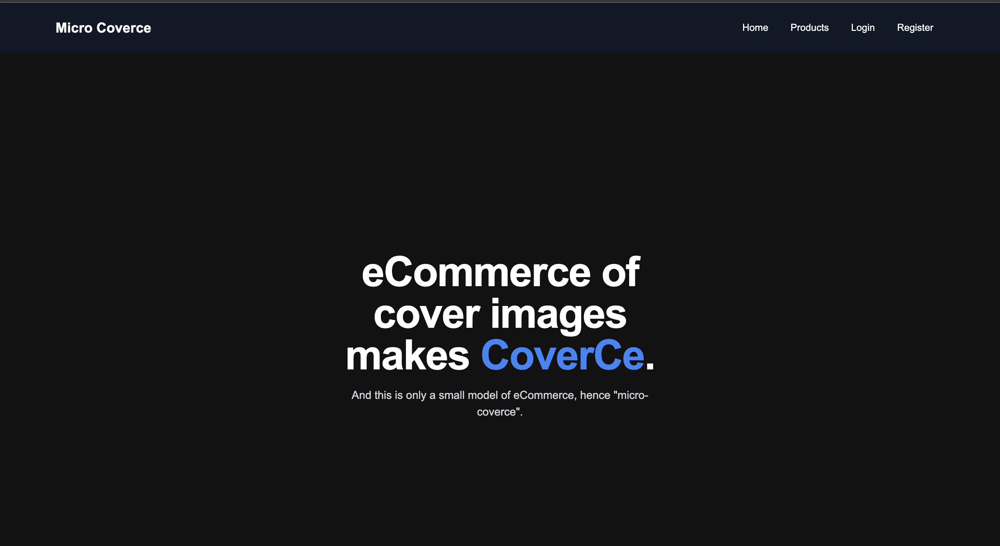

# Micro Coverce - Ecommerce Platform for Cover Images

Micro Coverce is a test project showcasing a simplified ecommerce platform for cover images. Users can register, log in, and explore a collection of cover images. They have the option to purchase cover images through Stripe payment integration or download free attachments.




## Features

- User Registration and Authentication: Allow users to create accounts and log in securely.
- Product Listing: Display a variety of cover images available for purchase.
- Product Detail: View detailed information about each cover image, including price and description.
- Shopping Cart: Add products to the cart and proceed to checkout using Stripe.
- Free Attachments: Offer free attachments that users can download without purchase.
- Superuser Access: Superusers can manage products and view additional functionality.

## Installation

1. Clone the repository:

   ```bash
   git clone https://github.com/Nirmal-Adhikari-hub/CoverCe.git
